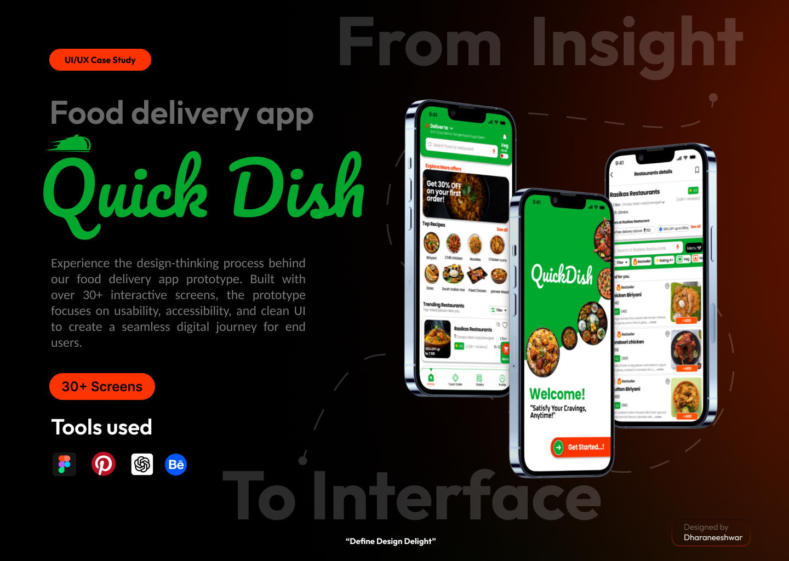

# 🍽️ Food Ordering App (UI/UX Design)

### 📖 Overview
This is a UI/UX design project for a **food ordering mobile application**, created using **Figma**.  
The design focuses on simplicity, smooth navigation, and a delightful user experience for browsing, ordering, and tracking food.

---

### ⭐ Features
- Clean and modern user interface  
- Easy food browsing with categories  
- Add to cart and order placement screens  
- Real-time order tracking  
- Profile and dietary preference options  

---

### 🛠️ Tools Used
- Figma  
- Canva
- ChatGPT
- Pinterest
- Behance

---

### 🔗 View Design
[Click here to open in Figma](https://www.figma.com/design/P9bvcRDZhJId9pYcglyqYU/Untitled?node-id=0-1&t=pJkg9vZ6GLLWQhMM-1)

---

*Designed by Dharaneeshwar  
